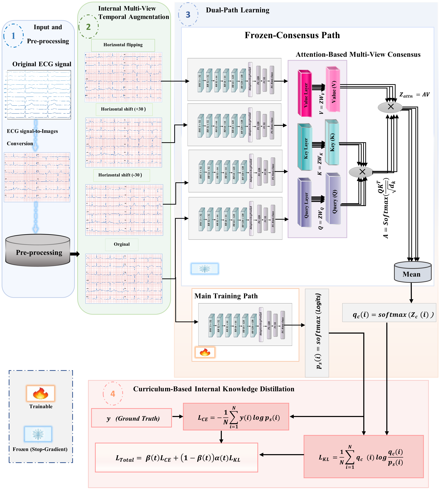

# EIA-CKD: End-to-End Internal Augmentation and Curriculum-Based Knowledge Distillation for Lightweight ECG Classification
Official implementation of EIA-CKD, a lightweight end-to-end framework for ECG classification using internal multi-view augmentation and curriculum-based knowledge distillation.

## Overview

Automated ECG classification is important for wearable and resource-constrained
healthcare applications, where high diagnostic performance must be achieved with
limited computational and memory resources.

We propose **EIA-CKD (End-to-End Internal Augmentation and Curriculum-Based
Knowledge Distillation)**, a lightweight framework that performs knowledge
distillation within a single network without requiring a separately pre-trained
teacher model.

During training, multiple views are internally generated from each ECG image
and processed through a shared lightweight CNN backbone. The resulting predictions
are aggregated by an attention-based consensus module to generate an internal
supervisory signal. A curriculum-based optimization strategy gradually increases
the contribution of this internal knowledge during training.

The backbone combines **depthwise separable convolutions**, residual learning,
and **Convolutional Block Attention Modules (CBAM)** to achieve a low computational
footprint while maintaining competitive classification performance.

The proposed framework was evaluated on the **PTB-XL** and **Chapman** ECG datasets.
With approximately **102K trainable parameters**, EIA-CKD achieves:

| Dataset | Accuracy | AUROC |
|---------|----------|-------|
| PTB-XL | 84.67% | 95.60% |
| Chapman | 94.23% | 99.16% |

These results demonstrate the potential of EIA-CKD for efficient ECG classification
in wearable and resource-constrained IoMT applications.

  

# Dataset

This directory contains documentation and instructions for obtaining and preparing the ECG datasets used in the experiments reported in the paper.

The proposed EIA-CKD framework was trained and evaluated using two publicly available benchmark datasets:

1. Chapman/Shaoxing 12-lead ECG Database
2. PTB-XL ECG Database

The original datasets are **not redistributed in this repository**. Users should obtain the datasets from their respective public sources and follow the preprocessing instructions provided in this repository.

---

## 1. Chapman/Shaoxing 12-lead ECG Database

The Chapman/Shaoxing dataset contains 12-lead ECG recordings sampled at 500 Hz with a duration of 10 seconds.

Four diagnostic classes were used in this study:

| Class | Description                          |
| ----- | ------------------------------------ |
| SR    | Normal Sinus Rhythm                  |
| SB    | Sinus Bradycardia                    |
| GSVT  | General Supraventricular Tachycardia |
| AFIB  | Atrial Fibrillation                  |

### Dataset source

The dataset is publicly available through Kaggle:

[Chapman/Shaoxing 12-lead ECG Database — Kaggle](https://www.kaggle.com/datasets/erarayamorenzomuten/chapmanshaoxing-12lead-ecg-database?utm_source=chatgpt.com)

Please refer to the original dataset publication and source page for dataset licensing, attribution, and usage conditions.

---

## 2. PTB-XL ECG Dataset

PTB-XL is a large publicly available 12-lead ECG dataset containing clinical ECG recordings annotated by expert cardiologists.

In this study, the superdiagnostic classification scheme was adopted.

Five diagnostic classes were used:

| Class | Description            |
| ----- | ---------------------- |
| NORM  | Normal ECG             |
| MI    | Myocardial Infarction  |
| STTC  | ST/T Change            |
| CD    | Conduction Disturbance |
| HYP   | Hypertrophy            |

### Dataset source

The PTB-XL dataset is publicly available through PhysioNet:

[PTB-XL — PhysioNet](https://physionet.org/content/ptb-xl/1.0.3/?utm_source=chatgpt.com)

Please refer to the official PhysioNet page for the dataset description, licensing, citation requirements, and access conditions.

---
## Experimental Setup

All experiments were implemented using **PyTorch** and conducted on the
**Kaggle** platform.

### Environment

| Component | Configuration |
|-----------|---------------|
| Python | 3.12.13 |
| PyTorch | 2.10.0 |
| CUDA | 12.8 |
| GPU | 2 × NVIDIA Tesla T4 |
| GPU Memory | 15 GB per GPU |
| Input Resolution | 300 × 300 |
| Epochs | 50 |
| Batch Size | 128 |
| Optimizer | AdamW |
| Learning Rate | 3 × 10⁻⁴ |
| Weight Decay | 1 × 10⁻⁵ |
| LR Scheduler | CosineAnnealingLR |
| Label Smoothing | 0.1 |
| Temperature | 3.0 |
## Evaluation Metrics

The proposed model is evaluated using the following standard metrics:

- Accuracy
- Recall (Sensitivity)
- Precision
- Specificity
- F1-Score
- AUROC
